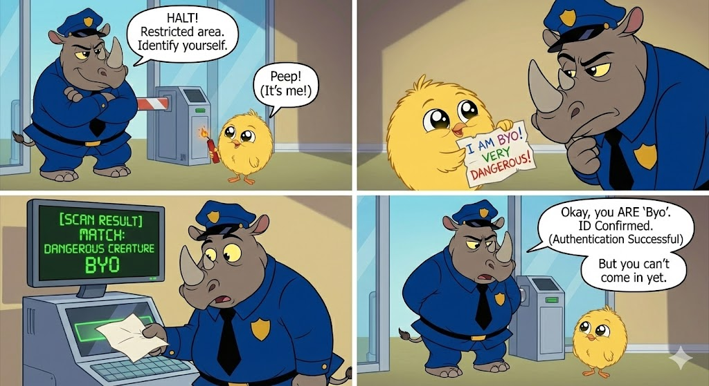
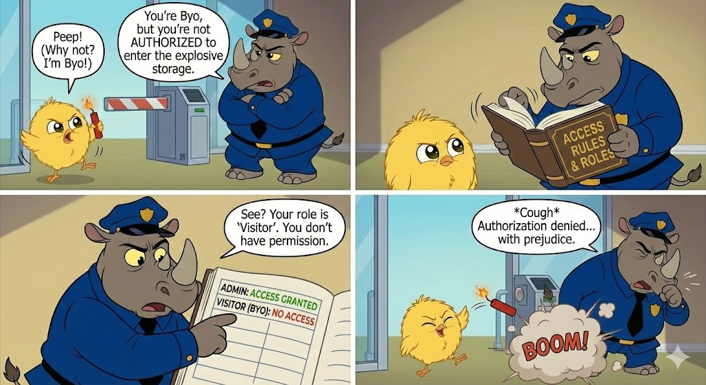

보안 시스템을 공부할 때 가장 먼저 마주치지만, 가장 많이 혼동하는 두 단어가 있습니다. 바로 '인증'과 '인가'입니다. 영어 철자도 비슷해서(Auth... 뭐시기) 더욱 헷갈리죠. 하지만 이 둘은 "건물 현관을 통과하는 것"과 "금고 문을 여는 것"만큼이나 결정적인 차이가 있습니다.

이 복잡하고 딱딱한 보안 개념을, 세상에서 가장 위험한 병아리 '뵤'와 그를 막아서는 철벽의 코뿔소 경찰 '바르가스 경사'의 '폭발물 보관소 침투 사건'을 통해 아주 쉽고 직관적으로 파헤쳐 보겠습니다.

그들은 과연 "너 누구야?"와 "너 권한 있어?"의 차이를 어떻게 보여줄까요?

## 인증(Authentication)

```
- 1컷. 접근 요청 (정문 앞의 대치)
	바르가스: (엄격한 목소리로) 정지! 여긴 관계자 외 출입 금지 구역이다. 누구냐, 신분을 밝혀라. 
	뵤: (전혀 쫄지 않고) 삐약! 삐이야악! (나야 나! 이 구역의 귀여운 파괴자! 문 열어!)

- 2컷. 자격 증명 제출 (꼬깃한 '신분증')
	뵤: 삐약. (자, 여기 내 확실한 신분증.) 
	바르가스: (한쪽 눈썹을 치켜뜨며 종이를 집어 든다) ...이 장난 같은 크레파스 낙서가 신분증이라고?

- 3컷. 검증 (스캔 및 DB 대조)
	스캐너 화면: [DB 대조 결과: 일치. 식별 코드 '위험 생물 뵤' 확인됨.] 
	바르가스: (모니터를 보며 약간 놀란 듯) 흠... 놀랍군. 시스템에 등록된 정보와 진짜로 일치해.

- 4컷. 인증 성공 (하지만 열리지 않는 문)
	바르가스: 좋아, 네가 '뵤' 본인이라는 건 확실히 확인됐다. (인증 성공) 
	뵤: 삐약~♪ (오케이, 그럼 들어간다?) 
	바르가스: (단호하게 앞을 가로막으며) 아니, 아직 들어갈 순 없어.
```

**"인증은 되었는데 왜 못 들어갈까?"**

뵤는 지금 무척 억울합니다. "내 신분증(종이)도 보여줬고, 스캔도 통과했는데(로그인 성공) 왜 안 비켜줘?!"

하지만 바르가스 경사의 논리는 단호합니다. "네가 '뵤'라는 건 알겠어. 하지만 네가 이 '1급 폭발물 창고'에 들어갈 **자격이 있는지는 아직 확인 안 했잖아?**"

## 인가(Authorization)

```
- 1컷. 접근 권한 요구 (왜 못 들어가?)
	뵤: (억울한 표정으로 날개를 파닥이며) 삐약? 삐이익! 
	바르가스: 진정해라. '신원'이 확인됐다고 해서 모든 방에 들어갈 수 있는 건 아니다. 
         이제 네가 이 '1급 폭발물 저장고'에 들어갈 자격(Permission)이 있는지 확인할 차례다.
    
- 2컷. 권한 조회 (ACL/Role 확인)
	바르가스: (허리춤에서 아주 두꺼운 '접근 제어 목록(ACL)' 규정집을 꺼내 펼치며) 
          어디 보자... 사용자 '뵤'에게 부여된 권한(Role)이...
	뵤: 삐약! 삐-약! (난 당연히 최강 등급이지! 내 손에 든 다이너마이트 안 보여?)
    
- 3컷. 판정 (권한 불일치 확인)
	규정집 클로즈업: `[사용자: 뵤] / [역할: 단순 방문객(Guest)] / [접근 가능 구역: 로비, 화장실 ONLY] / [위험 시설: 접근 불가(DENY)]`
	바르가스: (장부를 손가락으로 짚으며 비웃듯) 유감이군. 
          네 권한 등급은 고작 '방문객(Guest)'이다. 네가 갈 수 있는 곳은 입구의 화장실뿐이야.

- 4컷. 인가 거부 (403 Forbidden & 폭발)
	바르가스: 규정에 따라, 저장고 접근 승인을 거부한다. 
	뵤: 삐---약!!!! (이 꽉 막힌 똥고집 코뿔소야!!!!)
```

## 컴퓨터 세상의 두 가지 절대 관문

시스템은 뵤(사용자)가 위험한 곳에 함부로 접근하지 못하도록, 바르가스(보안 시스템)를 통해 다음과 같은 철저한 검문을 수행합니다.

**"당신, 누구입니까?" (Who are you?) - 인증(Authentication) **
- 🕵️‍♂️ 뵤의 상황
    - 크레파스로 쓴 신분증을 내밀고 스캔을 통과함.
    - _"나 뵤야! (신원 주장)"_ → _"그래, 너 뵤 맞구나. (신원 확인)"_

**"당신, 이곳에 들어올 자격이 있습니까?" (Are you allowed?) - 인가 (Authorization)**
- 🚫 뵤의 상황
    - 신원은 확인되었으나, '방문객 등급'이라 폭발물 창고 출입이 거부됨.
    - _"나 들어갈래! (권한 요청)"_ → _"안 돼, 넌 자격이 없어. (거부)"_

즉, 보안은 [인증]으로 '신분'을 확인하고, [인가]로 '자격'을 통제하는 과정입니다.


## 컴퓨팅 세상의 인증과 인가 
컴퓨팅 세상에서 인증과 인가는 뵤의 '종이 신분증'처럼 단순하지 않습니다. 인증 정보가 탈취되면 연동된 모든 시스템이 뚫릴 수 있으며, 실제로는 수많은 시스템이 얽혀 있기 때문입니다. 따라서 보안은 **서버**뿐만 아니라, 사용자가 사용하는 **브라우저**에서도 치밀하게 이루어져야 합니다.