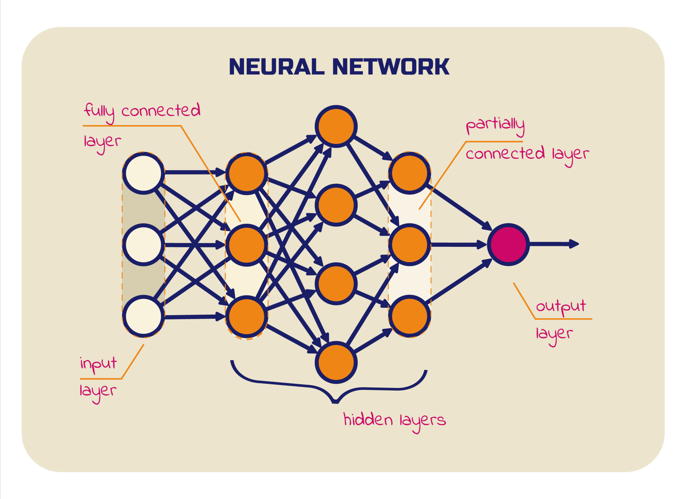

**모델은 데이터를 통해 배운 규칙과 패턴을 수식이나 구조로 정리해 놓은 결과물이다.**  
모델은 새로운 입력이 들어왔을 때, 과거의 학습을 바탕으로 **예측하거나 판단**을 수행한다.

즉, 모델은 데이터를 그대로 기억하는 것이 아니라,  
**데이터가 따르는 공통된 패턴을 학습해 판단 기준으로 삼는다.**

---

> _In simple words, machine learning is a process of training a machine or computer with huge amount of data so that it identifies the patterns and predicts the output._

머신러닝은 **컴퓨터에게 수많은 데이터를 경험하게 하고**,  
그 과정에서 **패턴을 스스로 발견해 미래의 결과를 예측하도록 만드는 과정**이다.

다르게 말하면,  머신러닝은 **모델이 더 정확한 출력을 만들 수 있도록 학습 데이터를 반복적으로 제공하는 과정**이라고 볼 수 있다.

---

## 모델과 머신러닝의 관계

- **모델**: 입력을 받아 출력을 만들어내는 구조
- **머신러닝**: 그 모델이 잘 동작하도록 데이터를 통해 학습시키는 과정

즉,

> **머신러닝은 모델을 만들고 다듬는 과정이며,  
> 모델은 그 결과로 만들어진 판단 도구다.**

---

## 모델의 종류

모델은 **출력을 만들어내는 구조와 방식**에 따라 나뉜다.  
대표적인 모델의 종류는 다음과 같다.

### 선형 회귀 모델

- 입력과 출력 사이의 관계를 직선으로 표현
- 연속적인 값을 예측하는 데 사용
- 단순하지만 해석이 쉬운 모델

### 로지스틱 회귀 모델

- 선형 회귀를 기반으로 한 **분류 모델**
- 출력값을 확률로 해석
- 주로 이진 분류 문제에 사용됨

`\hat{y} = \sigma(wx + b)`

- σ\sigmaσ: 시그모이드 함수
- 출력값은 0∼10 \sim 10∼1 사이의 확률
- “맞다 / 아니다”, “합격 / 불합격” 같은 판단에 적합

즉,

> **로지스틱 회귀는 값을 예측하는 것이 아니라,  
> 어떤 클래스에 속할 ‘확률’을 예측하는 모델이다.**

### 디시전 트리 모델

- 조건에 따라 데이터를 분기하는 구조
- 사람이 판단하는 방식과 유사
- 규칙이 명확하게 드러나는 모델

### KNN 모델

- 주변 데이터와의 거리로 결과를 결정
- 학습보다는 비교에 가까운 방식
- 데이터가 많아질수록 계산 비용 증가

### 신경망 모델

- 여러 층의 연산을 통해 복잡한 패턴을 학습
- 비선형 문제 해결 가능
- 딥러닝과 LLM의 기반이 되는 모델
---

## 그렇다면 LLM과 sLLM이란?
LLM과 sLLM은 **신경망 모델을 기반으로 한 언어 특화 모델**이다.

### LLM (Large Language Model)

LLM은 **방대한 텍스트 데이터를 학습해  
언어의 패턴을 이해하고 생성하는 대규모 언어 모델**이다.

문장의 흐름, 문맥, 의미를 확률적으로 학습해  
다음 단어를 예측하는 방식으로 동작한다.

즉,

> **LLM은 언어 데이터를 대상으로 학습한 초대형 신경망 모델이다.**

---

### sLLM (Small / Specialized LLM)

sLLM은 LLM의 개념을 유지하면서,  
**모델의 크기나 목적을 제한한 언어 모델**을 의미한다.

- 모델 크기를 줄여 빠르고 가볍게 만든 경우
- 특정 도메인이나 업무에 맞게 학습된 경우

즉,

> **sLLM은 범용성보다 효율과 목적에 집중한 LLM**이다.