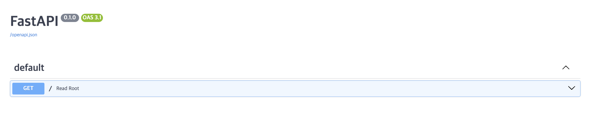

# FastAPI 시작하기
{: .fs-9 }

FastAPI는 간단하게 Python으로 빠르고 안정적인 API를 구축할 수 있는 강력한 프레임워크입니다. 몇 가지 설정만으로도 개발을 시작할 수 있으며, 자동화된 문서화와 유효성 검사를 통해 손쉽게 API를 관리할 수 있습니다.

## 설치 
Mac OS 환경을 대상으로 하며, Python 버전을 3.8 이상으로 구성해야 합니다.

### Python Version 
파이썬 버전이 3.8 이상의 버전인지 확인합니다. 
```sh
$ python --version 
```

### 가상환경 설치 및 실행 
파이썬 가상환경을 구성합니다.
```sh
# 가상환경 다운로드 
$ python -m venv .venv

# 가상환경 실행
$ source .venv/bin/activate
```

### 라이브러리 설치 
FastAPI를 사용하기 위해서는 먼저 Python 패키지 관리자인 `pip`을 통해 설치해야 합니다. 터미널에서 다음 명령어를 실행하세요:
```sh 
# FastAPI 라이브러리 설치 
$ pip install "fastapi[standard]"

# 프로덕션을 위한 ASGI 서버 설치 [uvicorn 서버]
$ pip install "uvicorn[standard]"
```

### FastAPI 실행 소스 작성
프로젝트 폴더에 `main.py` 파일을 생성하고 아래와 같은 코드를 작성합니다:
```python 
from fastapi import FastAPI # FastAPI 라이브러리를 임포트합니다.

app = FastAPI() # FastAPI 애플리케이션을 생성합니다.

# "/" 경로로 요청이 들어오면 실행될 함수입니다.
@app.get("/")
async def read_root():
    return {"Hello": "World"} # {"Hello": "World"} 응답을 반환합니다.
```
이 코드에서는 FastAPI 애플리케이션을 정의하고, `@app.get("/")` 데코레이터를 사용해 루트 경로(`/`)로 들어오는 GET 요청을 처리하도록 설정했습니다.

#### 코드 설명
- `app = FastAPI()`: FastAPI 애플리케이션 객체를 생성합니다. `app`이라는 이름으로 애플리케이션을 설정하여 이 객체를 통해 API의 각 엔드포인트와 설정을 정의합니다.
- `@app.get("/")`: 이 부분은 데코레이터로, GET 요청이 들어올 때 어떤 함수가 실행될지 지정합니다. 여기서는 `"/"` 경로로 들어오는 요청을 `read_root()` 함수가 처리하게 됩니다.
- `def read_root()`: 이 함수는 루트 경로(/)로 들어오는 GET 요청을 처리하는 역할을 합니다. 함수를 호출하면 JSON 형식의 `{"Hello": "World"}` 응답이 반환됩니다.

## 실행 
FastAPI 애플리케이션을 실행하는 방법에는 debug mode와 uvicorn 서버 두 가지가 있습니다. 각 방식의 차이와 실행 예시는 다음과 같습니다.

### debug mode 실행
FastAPI는 개발 모드에서 실행할 때 자동 리로딩 기능을 제공합니다. 코드 변경 시 서버를 자동으로 다시 시작하기 때문에, 개발 중에 빠르게 변경 사항을 확인할 수 있습니다.
```sh 
$ fastapi dev main.py
```

이 명령을 실행하면 아래와 같은 메시지가 출력됩니다:
```
╭────────── FastAPI CLI - Development mode ───────────╮
│                                                     │
│  Serving at: http://127.0.0.1:8000                  │
│                                                     │
│  API docs: http://127.0.0.1:8000/docs               │
│                                                     │
│  Running in development mode, for production use:   │
│                                                     │
│  fastapi run                                        │
│                                                     │
╰─────────────────────────────────────────────────────╯

INFO:     Will watch for changes in these directories: ['/home/user/code/awesomeapp']
INFO:     Uvicorn running on http://127.0.0.1:8000 (Press CTRL+C to quit)
INFO:     Started reloader process [2248755] using WatchFiles
INFO:     Started server process [2248757]
INFO:     Waiting for application startup.
INFO:     Application startup complete.
```

### uvicorn을 통한 실행
uvicorn은 ASGI 서버로, FastAPI 애플리케이션을 서빙하기 위해 사용됩니다. 기본적으로 개발 및 프로덕션 환경에서 모두 사용할 수 있으며, `--reload` 옵션을 통해 개발 모드로 실행할 수 있습니다.

```
$ uvicorn main:app --reload
```

이 명령을 실행하면 다음과 같은 메시지가 출력됩니다:
```
INFO:     Uvicorn running on http://127.0.0.1:8000 (Press CTRL+C to quit)
INFO:     Started reloader process [28720]
INFO:     Started server process [28722]
INFO:     Waiting for application startup.
INFO:     Application startup complete.
```

## 테스트
FastAPI 애플리케이션이 성공적으로 실행되었다면, FastAPI는 자동으로 API 문서를 생성합니다. 이를 통해 API 엔드포인트와 요청/응답 형식을 시각적으로 확인할 수 있습니다.

### Swagger UI 문서 페이지에 접근
실행 후, 브라우저에서 다음 URL을 입력하여 API 문서 페이지에 접근할 수 있습니다.
```
http://127.0.0.1:8000/docs
```


