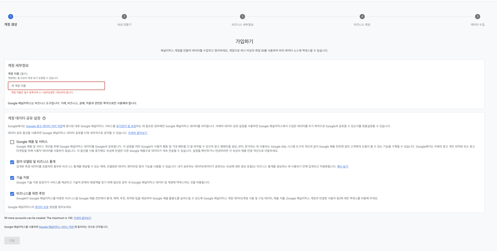
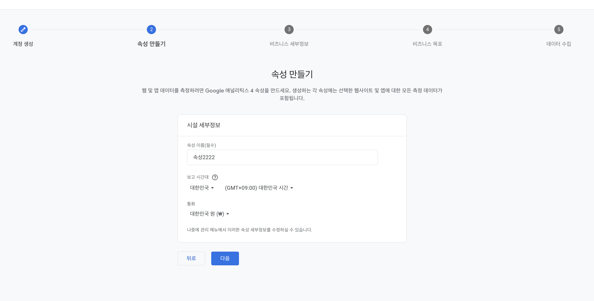
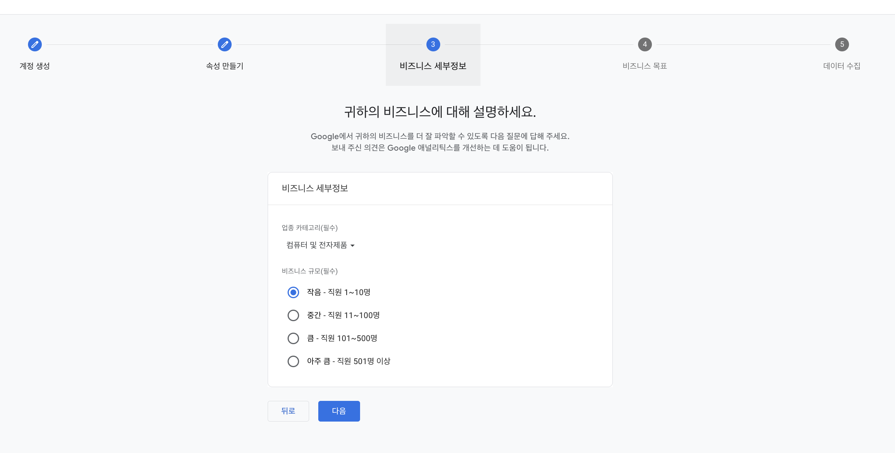
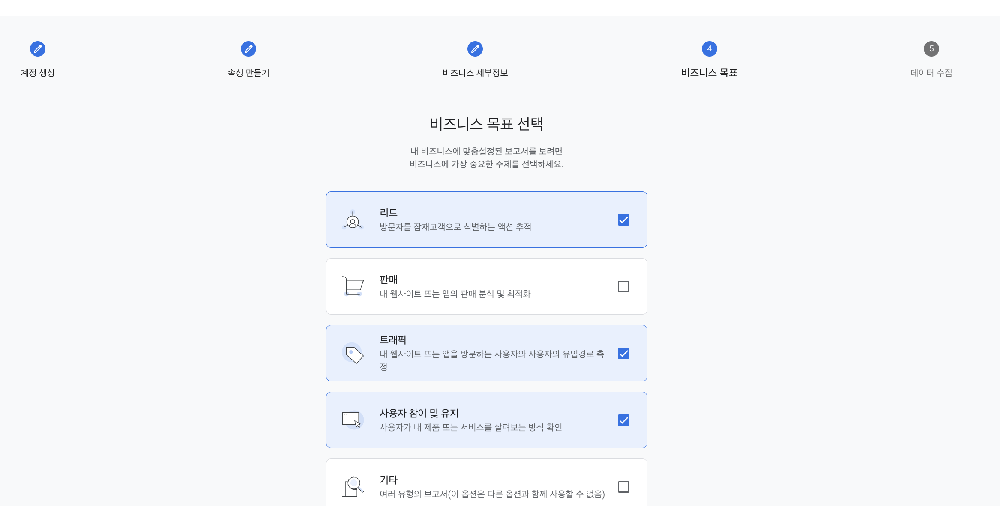
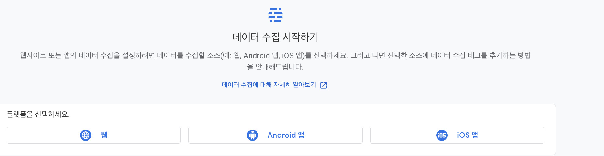
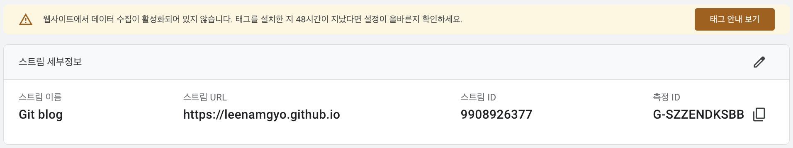

# GA 시작하기 
{: .fs-9 }

- 공식 홈페이지: [Google Anaytics (GA) Page](https://marketingplatform.google.com/about/analytics/)

모든 설정은 관리 페이지에서 쉽게 변경할 수 있습니다. 처음 시작하는 분들은 초기 설정을 잘못해도 큰 문제가 생기지 않으니, 부담 없이 시작해 보세요.

## GA 사이트 입장 

GA 사이트에 들어가면 위와 같은 화면이 표시됩니다. **지금 시작하세요**라는 파란색 버튼을 클릭하면 계정 생성 페이지로 이동할 수 있습니다.

## 계정 생성 

**계정(Account)**은 하나의 Google Analytics 계정은 여러 웹사이트 또는 앱의 데이터를 관리할 수 있습니다. 계정은 조직 단위의 대시보드로, 여러 프로젝트나 자산들을 관리할 수 있도록 합니다.

## 속성 설정 

**속성(Property)**은 각 계정에는 하나 이상의 속성을 설정할 수 있습니다. 속성은 특정 웹사이트 또는 앱과 연결되며, 데이터를 수집하는 단위입니다. 속성별로 추적 ID가 부여되며, 이 ID를 통해 각 속성에 데이터를 전송할 수 있습니다.

## 비즈니스 세부 설정 

Google Analytics의 비즈니스 설정은 비즈니스 목표에 부합하는 데이터를 효율적으로 수집하고 분석할 수 있게 하여, 더 나은 데이터 기반의 의사 결정을 지원하는 데 그 목적이 있습니다.

## 비즈니스 목표 설정 

알맞은 **비즈니스 목표**를 설정하여 맞춤설정된 보고서를 받도록 합니다. 목표 설정이 끝난 후 Google Analytics 동의서에 동의한 후 게정 설정을 마칩니다.

## 데이터 스트림 설정 



데이터 스트림(Data Stream)은 Google Analytics 4(GA4)에서 웹사이트나 앱과 같은 디지털 자산에서 발생하는 사용자 활동 데이터를 실시간으로 수집하는 데이터 흐름을 의미합니다. 이는 사용자와의 상호작용 데이터를 자동으로 분석 시스템으로 보내주는 통로 역할을 합니다.


## 웹 사이트 등록
각 웹 사이트의 `<html>` 코드의 `<head>` 해당 내용을 추가합니다. 
```
<!-- Google tag (gtag.js) -->
<script async src="https://www.googletagmanager.com/gtag/js?id=G-SZZENDKSBB"></script>
<script>
  window.dataLayer = window.dataLayer || [];
  function gtag(){dataLayer.push(arguments);}
  gtag('js', new Date());

  gtag('config', 'G-DJZEWV65M6');
</script>
```

