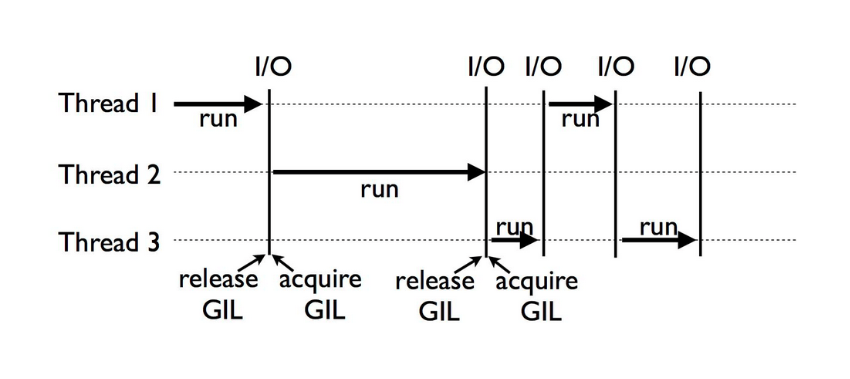

# Multi thread
{: .fs-9 }


공식 Python(CPython)의 멀티스레드를 활용할 때 완벽한 병렬 처리가 어렵다는 사실은 많은 Python 사용자들이 잘 알고 있습니다. 이 한계는 바로 GIL(Global Interpreter Lock)이라는 멀티스레드(또는 `mutex`) 락 때문인데요. GIL은 Python 인터프리터가 동시에 하나의 스레드만 실행할 수 있도록 제한을 겁니다. 즉, Python에서 GIL은 여러 스레드가 실행되는 것처럼 보여도 실제로는 한 번에 하나의 스레드만 CPU를 차지할 수 있는 구조로 실행되게 만듭니다. 


## 단일스레드 vs 멀티스레드

### 구현 
아래는 숫자 합계를 계산하는 데 있어 단일 스레드와 멀티스레드 방식의 성능을 비교하는 내용으로 수정된 코드입니다. 이 코드는 1부터 𝑛까지의 숫자 합계를 계산하며, 최종적으로 GIL(Global Interpreter Lock)이 성능에 미치는 영향을 확인할 수 있습니다.
```python
import threading
import time

# 숫자 합계를 계산하는 단일 스레드 함수
def single_threaded_sum(n):
    return sum(range(n))

# 숫자 합계를 계산하는 멀티스레드 함수
def sum_range(start, end, result, index):
    total = sum(range(start, end))
    result[index] = total  # 결과를 리스트에 저장

def multi_threaded_sum(n, num_threads=4):
    threads = []
    result = [0] * num_threads  # 결과를 저장할 리스트
    range_size = n // num_threads  # 각 스레드가 계산할 범위의 크기

    for i in range(num_threads):
        start = i * range_size
        end = (i + 1) * range_size if i != num_threads - 1 else n
        thread = threading.Thread(target=sum_range, args=(start, end, result, i))
        threads.append(thread)
        thread.start()

    for thread in threads:
        thread.join()

    return sum(result)  # 각 스레드의 결과를 합산

# 실행할 숫자
n = 10_000_000_00

# 단일 스레드 성능 측정
start_time = time.time()
total_sum_single = single_threaded_sum(n)
single_thread_duration = time.time() - start_time
print(f"단일 스레드: 1부터 {n}까지의 합: {total_sum_single}, 실행 시간: {single_thread_duration:.2f} 초")

# 멀티스레드 성능 측정
start_time = time.time()
total_sum_multi = multi_threaded_sum(n)
multi_thread_duration = time.time() - start_time
print(f"멀티 스레드: 1부터 {n}까지의 합: {total_sum_multi}, 실행 시간: {multi_thread_duration:.2f} 초")
```

### 결과 
코드를 실행하면, 각 방식의 합계와 실행 시간이 출력됩니다. 멀티스레드가 더 빠른 경우가 많지만, GIL 때문에 큰 차이가 나지 않을 수도 있습니다.
```
단일 스레드: 1부터 1000000000까지의 합: 499999999500000000, 실행 시간: 8.32 초
멀티 스레드: 1부터 1000000000까지의 합: 499999999500000000, 실행 시간: 8.30 초
```

## 멀티스레드 대안 
Python에서 멀티스레드의 대안으로 사용할 수 있는 몇 가지 방법이 있습니다. 이러한 방법들은 GIL(Global Interpreter Lock)로 인해 발생하는 성능 저하를 피하면서 병렬 처리를 구현할 수 있도록 돕습니다. 다음은 몇 가지 주요 대안입니다:
- 멀티프로세싱 (Multiprocessing): multiprocessing 모듈은 여러 프로세스를 생성하여 각 프로세스가 독립적으로 실행되도록 합니다. 각 프로세스는 별도의 메모리 공간을 가지므로 GIL의 영향을 받지 않습니다.
- 비동기 프로그래밍 (Asyncio): asyncio 모듈을 사용하면 비동기 I/O 작업을 수행하여 프로그램이 다른 작업을 기다리는 동안에도 실행을 계속할 수 있습니다. CPU-bound 작업에는 적합하지 않지만, I/O-bound 작업에서는 효과적입니다.
- C 확장 모듈: Python의 성능을 향상시키기 위해 C 언어로 작성된 확장 모듈을 사용하는 방법도 있습니다. C에서 GIL을 제어하는 방법을 통해 더 나은 성능을 얻을 수 있습니다.
- 다른 Python 오픈 소스 사용

등 여러가지 방안이 있습니다. 다음 게시물에는 이러한 것들에 대해 알아보도록 하겠습니다.