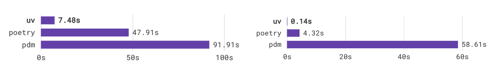

# UV: Cargo for Python
An extremely fast Python package and project manager, written in Rust.

**UV**는 **Astral**사가 개발한 **Rust 기반의 Python 패키지 매니저**입니다. 이 도구는 Astral사가 개발한 두 번째 프로젝트로, 첫 번째는 linter 도구인 `ruff`였습니다. UV는 **Rust의 패키지 매니저인 `Cargo`의 개념을 벤치마킹**하여 제작되었습니다. UV는 오픈소스 프로젝트로, **Apache-2.0 및 MIT 라이선스**가 적용되어 **자유롭게 사용 및 배포가 가능합니다**.

**UV는 Astral이 지향하는 '고성능(high-performance)' 철학을 그대로 반영한 도구로, 높은 생산성을 목표로 설계되었습니다.** 실제로 타사의 패키지 매니저들과 비교했을 때 **10~100배에 달하는 속도 향상**을 보여주는 등 **눈에 띄는 성능 개선**을 입증하고 있습니다.



첫 번째 프로젝트인 `ruff`와 달리 **상업화와 관련된 구체적인 계획은 아직 공개되지 않았습니다**. 다만 Astral 측은 "*Our plan is to provide paid services that are better and easier to use than the alternatives by integrating our open-source offerings directly (*오픈소스 도구들을 통합해, 기존 대안들보다 더 나은 유료 서비스를 제공할 계획)"이라고 밝힌 바 있습니다. **개인적인 생각으로 개별 오픈소스 도구를 직접 유료화하기보다는, 이를 통합한 형태로 상업화를 진행할 가능성이 높을 것 같습니다.**

2024년 8월 20일에 공개된 이 프로젝트는 아직 정식 릴리스를 거치지 않은 v0.7 버전으로, 안정성 면에서는 다소 미흡할 수 있습니다. 그럼에도 불구하고 GitHub에서 51.9k stars와 1.5k forks를 기록하며 활발한 개발이 진행 중입니다

## 설치

- standalone 설치

```python
(linux, mac) curl -LsSf https://astral.sh/uv/install.sh | sh
(mac) brew install uv 
```

## 사용법

1. **새 프로젝트 생성**
    
    ```bash
    uv init myproj
    cd myproj
    ```
    
    `.gitignore`, `.python-version`, `main.py`, `pyproject.toml`, `README.md` 등이 생성됩니다 [docs.astral.sh](https://docs.astral.sh/uv/guides/projects/?utm_source=chatgpt.com).
    
2. **프로젝트 구조**
    - `pyproject.toml`: 패키지 정보 및 `[tool.uv]` 설정 포함
    - `.python-version`: 사용 Python 버전
    - `.venv`: venv 설치 경로
    - `uv.lock`: 플랫폼 독립적인_LOCK 파일(수정 금지) [docs.astral.sh](https://docs.astral.sh/uv/guides/projects/?utm_source=chatgpt.com).
3. **의존성 관리**
    
    ```bash
    uv add requests
    uv add 'requests==2.31.0'
    uv add git+https://...
    uv remove requests
    uv lock --upgrade-package requests
    ```
    
4. **환경 생성 및 실행**
    
    ```bash
    uv venv --python 3.12.0
    source .venv/bin/activate
    uv run main.py
    ```
    
    `uv run`은 항상 lock과 env 일관성을 자동 보장
    
5. **Lock 파일 관리**
    - `uv sync`: lock→env 동기화
    - `.venv` 활성화 후 자유롭게 스크립트 실행 가능 .

1. **빌드 & 배포**
    
    ```bash
    uv build
    ```
    
    `dist/` 폴더에 wheel 및 source 배포본 생성
    

---

## 📦 pip 호환 인터페이스 (`uv pip`)

- 기존 `pip`, `pip-tools`, `virtualenv` 명령어를 거의 그대로 대체 가능하며 속도는 10~100배 빠름
- 예시:
    
    ```bash
    uv pip compile requirements.in --universal -o requirements.txt
    uv pip sync requirements.txt
    uv pip install --python 3.12 pip
    ```
    
    (CI 환경에서 `--system` 또는 `UV_SYSTEM_PYTHON=1`로 시스템 범위 설치 가능)
    

## 기타

- **`.venv` 디렉토리 자동 감지**
`uv`는 기본적으로 현재 작업 디렉토리 또는 가장 가까운 상위 디렉토리에서 `.venv`라는 이름의 가상 환경을 자동으로 찾습니다. 만약 이 디렉토리에 가상 환경이 존재하면 `uv`는 해당 환경을 사용하여 작업을 수행합니다.

## 참고

- Github: https://github.com/astral-sh/uv
- UV Blog: https://astral.sh/blog/uv-unified-python-packaging
- 공식 홈페이지: https://astral.sh/blog/uv
