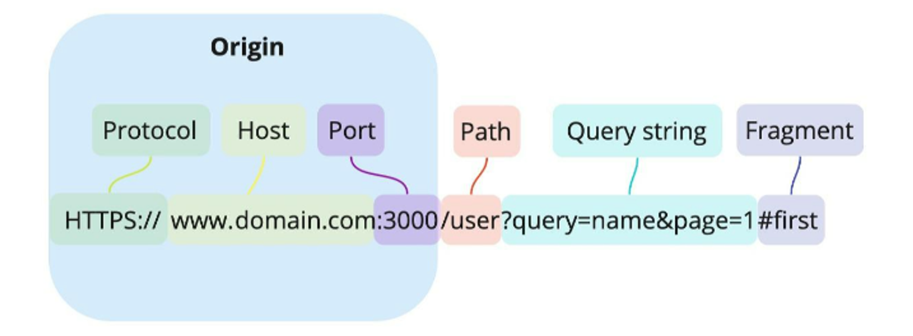

# Cross-Origin Resource Sharing
`CORS (Cross-Origin Resource Sharing)`는 웹 애플리케이션이 다른 출처(`origin`)에서 리소스에 접근할 수 있도록 허용하는 메커니즘입니다. `CORS`는 웹 보안의 중요한 부분으로, 브라우저가 기본적으로 적용하는 `SOP(Same-Origin Policy)`의 제한을 극복하기 위해 개발되었습니다. 

들어가기 앞서, `SOP`와 `CORS`가 말하는 출처의 정의는 무엇일까요?

## 출처(origin)의 정의 
웹에서 출처(`origin`)란 웹 페이지가 위치한 위치를 정의하는 중요한 개념입니다. 출처는 `scheme`, `host`, `port`의 세 가지 요소로 구성됩니다. 각 요소는 다음과 같은 의미를 가집니다:




**`SOP`, `CORS`에서 말하는 동일한 출처는 두 개의 URL을 비교하여 프로토콜, 호스트, 포트가 모두 동일한 경우를 의미합니다.** 예를 들어, 하나의 출처가 `http://leenamgyo.github.io/dir/page.html`일 경우, 다음과 같은 출처 비교가 가능합니다:
<br>

|URL|Outcome|Reason|
|:-------------|:------------------|:------|
|`http://leenamgyo.github.io/dir2/other.html`|Same origin|동일 출처, 다른 경로|
|`http://leenamgyo.github.io/dir/inner/another.html`|Same origin|동일 출처, 다른 경로|
|`https://leenamgyo.github.io/page.html`|Failure|다른 `scheme(protocol)`|
|`http://leenamgyo.github.io:81/dir/page.html`|Failure|댜른 `port` (http:// is port 80 by default)|
|`http://news.company.com/dir/page.html`|Failure|더룬 `domain(host)`|


## SOP(Same-Origin Policy)
`SOP(Same-Origin Policy)`는 웹 보안에서 중요한 개념으로, 브라우저가 하나의 출처(`origin`)에서 로드된 웹 페이지가 다른 출처에서 로드된 리소스에 접근하는 것을 제한하는 보안 메커니즘입니다. 이 정책은 주로 `XSS`, `CSRF` 등 악성 스크립트가 사용자 데이터를 탈취하거나 다른 웹 페이지에 무단으로 접근하는 것을 방지하기 위해 설계되었습니다.


## SOP와 CORS
`SOP`는 기본적인 보안 메커니즘으로, 웹 애플리케이션이 다른 출처의 리소스에 접근하는 것을 기본적으로 차단합니다. 그러나 웹 개발에서는 다른 출처의 API와 상호작용할 필요가 종종 발생하므로, `CORS`라는 정책이 도입되었습니다. `CORS`는 서버가 특정 출처의 요청을 허용할 수 있도록 해주는 메커니즘으로, `SOP`의 제약을 완화합니다.

결론적으로, `SOP`는 웹 애플리케이션의 보안을 강화하고 사용자 데이터를 보호하는 데 중요한 역할을 하며, `CORS`는 이러한 제한을 상황에 맞게 조정할 수 있는 방법을 제공합니다.


## SOP 정책을 CORS로 완화하는 예
로컬 개발 환경인 `http://localhost:3000`에서 실행 중인 애플리케이션이 `https://example.com`에 요청을 보내려고 할 때, 브라우저는 `SOP` 정책에 의거하여 다음과 같은 오류 메시지를 표시할 수 있습니다:

```
Access to fetch at ‘https://example.com’ from origin ‘http://localhost:3000’ has been blocked 
by CORS policy: No ‘Access-Control-Allow-Origin’ header is present on the requested resource. 
If an opaque response serves your needs, set the request’s mode to ‘no-cors’ to fetch 
the resource with CORS disabled.
```

이 문제는 `CORS`를 통해 해결할 수 있습니다. `CORS`는 특정 출처에서 오는 요청을 허용하는 메커니즘으로, 서버가 클라이언트의 요청에 응답할 때 특정 헤더를 추가함으로써 동작합니다. 서버는 응답 헤더에 `Access-Control-Allow-Origin`을 추가하여 어떤 출처의 요청을 수용할지를 결정합니다.

## CORS의 동작 


## CORS의 설정방법 


## 참조 
- https://developer.mozilla.org/en-US/docs/Web/Security/Same-origin_policy
- https://developer.mozilla.org/ko/docs/Web/Security/Same-origin_policy
- https://en.wikipedia.org/wiki/Same-origin_policy
- https://velog.io/@wogkr1383/SOP%EC%99%80-CORS


