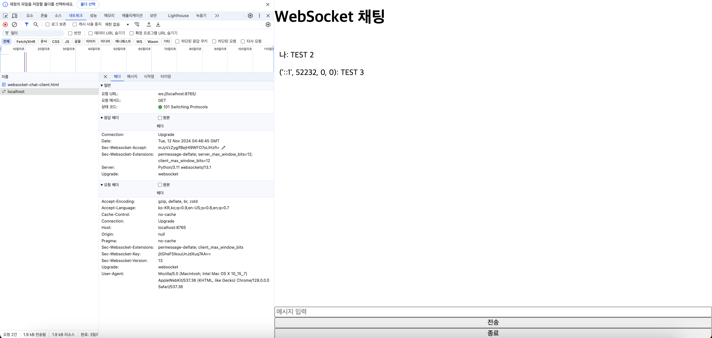

# WebSocket 예제 - Chat 
{: .fs-9 }

채팅 서버를 구현할 때 WebSocket은 실시간 양방향 통신, 낮은 오버헤드, 서버 푸시 기능, 지속적인 연결 유지, 브라우저 지원, 높은 확장성 등으로 인해 최적의 선택입니다.

- **실시간 양방향 통신**: 클라이언트와 서버가 연결된 상태에서 데이터를 자유롭게 주고받아, 메시지 전달이 즉시 가능합니다.
- **HTTP 대비 낮은 오버헤드**: HTTP 요청-응답 방식보다 효율적이며, 연결을 유지하므로 반복적인 연결 비용이 줄어듭니다.
- **서버 푸시 기능**: 서버에서 클라이언트로 데이터를 직접 푸시할 수 있어, 새로운 메시지가 즉각 전송됩니다.
- **지속적인 연결 유지**: 연결이 끊어지지 않아 사용자 세션과 연결 상태를 쉽게 관리할 수 있습니다.
- **브라우저 기본 지원**: 대부분의 최신 브라우저에서 WebSocket API를 기본 제공해, 쉽게 구현할 수 있습니다.
- **확장성과 성능**: 비동기 I/O를 활용해 많은 동시 접속을 처리할 수 있어, 채팅 서버의 성능이 뛰어납니다.

## 구현 

### Server.py 
```python
import asyncio
import websockets

connected_clients = set()

async def handler(websocket, path):
    connected_clients.add(websocket)
    print(f"클라이언트 접속: {websocket.remote_address}")
    try:
        async for message in websocket:
            if message == "/exit":
                # 클라이언트가 /exit 메시지를 보내면 연결 종료
                await websocket.close()
                break
            for client in connected_clients:
                if client != websocket:
                    await client.send(f"{websocket.remote_address}: {message}")
    finally:
        connected_clients.remove(websocket)
        print(f"클라이언트 연결 해제: {websocket.remote_address}")

async def main():
    async with websockets.serve(handler, "localhost", 8765):
        print("WebSocket 서버 시작. ws://localhost:8765 에 연결")
        await asyncio.Future()  # run forever

if __name__ == "__main__":
    asyncio.run(main())
```


### Client.html
```html
<!DOCTYPE html>
<html>
<head>
<title>WebSocket 채팅 클라이언트</title>
<style>
body {
    display: flex;
    flex-direction: column;
    height: 100vh;
    margin: 0;
}
#chatbox {
    flex: 1;
    overflow-y: scroll;
    padding: 10px;
}
</style>
</head>
<body>
    <h1>WebSocket 채팅</h1>
    <div id="chatbox"></div>
    <input type="text" id="message" placeholder="메시지 입력">
    <button onclick="sendMessage()">전송</button>
    <button onclick="closeConnection()">종료</button>

    <script>
        var websocket = new WebSocket("ws://localhost:8765");

        websocket.onopen = function(event) {
            console.log("WebSocket 연결 성공");
        };

        websocket.onmessage = function(event) {
            var message = event.data;
            var chatbox = document.getElementById("chatbox");
            var newMessage = document.createElement("p");
            newMessage.textContent = message;
            chatbox.appendChild(newMessage);
        };

        websocket.onerror = function(event) {
            console.error("WebSocket 에러:", event);
        };

        websocket.onclose = function(event) {
            console.log("WebSocket 연결 종료");
        };

        function sendMessage() {
            var messageInput = document.getElementById("message");
            var message = messageInput.value;
            
            // 클라이언트가 보낸 메시지도 chatbox에 표시
            var chatbox = document.getElementById("chatbox");
            var newMessage = document.createElement("p");
            newMessage.textContent = "나: " + message; 
            chatbox.appendChild(newMessage);

            websocket.send(message);
            messageInput.value = "";
        }

        function closeConnection() {
            websocket.send("/exit");
            websocket.close();
        }
    </script>
</body>
</html>
```

## 실행 

- HandShake는 요청 헤더, 응답 헤더를 통해 확인 가능합니다.
- WebSocket 통신은 브라우저 개발자 도구의 Network 탭에서 확인할 수 있습니다. 다만, HTTP 통신과는 다른 방식으로 표시됩니다. WebSocket 연결이 생성되고, **메시지** 탭에서 해당 연결을 통해 주고받는 메시지들이 시간 순서대로 표시됩니다.
