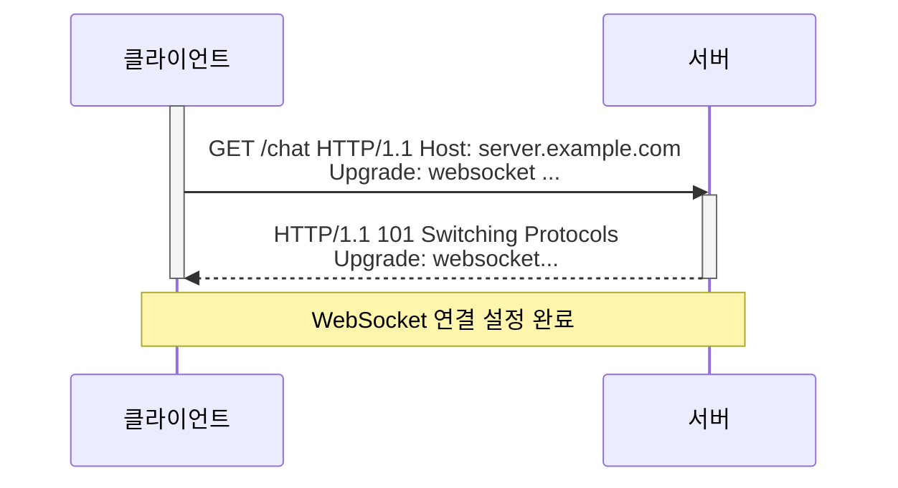
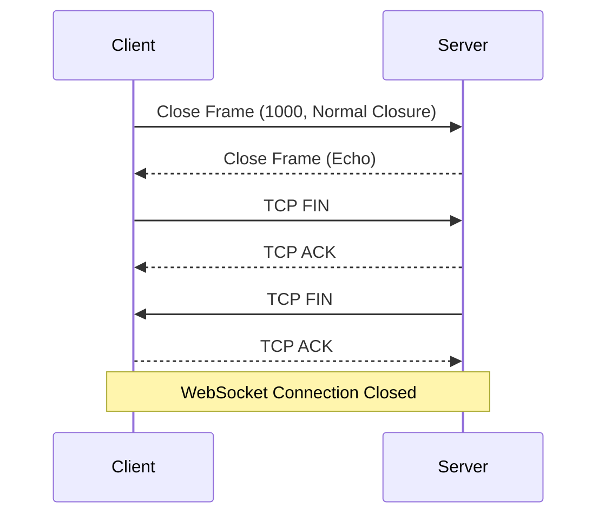

# Web Socket
{: .fs-9 }

[RFC 6455](https://datatracker.ietf.org/doc/html/rfc6455) 문서에 따르면, 웹소켓은 HTTP 폴링의 비효율성을 극복하기 위해 만들어진 기술이라고 한다. HTTP 폴링은 클라이언트가 서버에 계속해서 요청을 보내 정보 업데이트를 확인하는 방식입니다. 이는 HTTP 프로토콜의 특성상 클라이언트가 늘어날수록 서버에 큰 부담을 주게 됩니다. 구체적으로 HTTP 폴링은 다음과 같은 문제점을 가지고 있습니다.

- **TCP 소켓 과부하**: 각 클라이언트의 요청마다 TCP 소켓을 생성해야 하므로 서버 리소스를 과도하게 사용합니다.
- **헤더 정보의 중복**: 모든 요청에 HTTP 헤더 정보가 포함되어 있어 불필요한 데이터 전송으로 인해 서버 리소스를 낭비합니다.
- **클라이언트 부담**: 클라이언트는 각 요청과 응답을 매번 연결해야 하므로 처리 부담이 증가합니다.

웹소켓은 이러한 문제점을 해결하기 위해 양방향 통신을 지원하고, 하나의 TCP 연결을 통해 데이터를 주고받을 수 있도록 설계되었습니다. 이를 통해 서버 리소스를 효율적으로 사용하고, 클라이언트의 부담을 줄여 실시간 웹 애플리케이션 구현에 효과적인 기술입니다.

## HandShake 
완전히 새로운 프로토콜을 만들면, 기존 웹 환경과 호환이 안 되는 문제가 발생합니다. 그래서 WebSocket은 기존 HTTP 인프라를 최대한 활용하는 방식을 택하였습니다.
- HTTP와 같은 포트(80, 443)를 사용: 방화벽, 프록시 서버 등 기존 네트워크 장비를 그대로 사용할 수 있도록 했습니다.
- HTTP 업그레이드 방식: 처음에는 HTTP로 통신하다가, WebSocket으로 업그레이드하는 방식을 사용합니다. 덕분에 기존 웹 서버와도 호환성을 유지할 수 있습니다.즉, WebSocket은 "HTTP를 활용하여 양방향 통신을 효율적으로, 안정적으로 처리할 수 있도록 설계된 프로토콜"이라고 이해할 수 있습니다.


WebSocket 핸드셰이크가 성공적으로 이루어진 후에는 클라이언트와 서버 간에 양방향으로 데이터를 주고받을 수 있습니다.

### Opening
**Client To Server**
```
    GET /chat HTTP/1.1
        Host: server.example.com
        Upgrade: websocket
        Connection: Upgrade
        Sec-WebSocket-Key: dGhlIHNhbXBsZSBub25jZQ==
        Origin: http://example.com
        Sec-WebSocket-Protocol: chat, superchat
        Sec-WebSocket-Version: 13
```
- `Upgrade: websocket`: 이 헤더는 클라이언트가 WebSocket 연결로 업그레이드를 원한다는 것을 나타냅니다.
- `Connection: Upgrade`: 이 헤더는 연결을 업그레이드해야 함을 나타냅니다.
- `Sec-WebSocket-Key`: 클라이언트에서 생성한 랜덤한 값으로, 서버가 응답에 사용합니다.
- `Origin`: 클라이언트의 출처를 나타냅니다.
- `Sec-WebSocket-Protocol`: 클라이언트가 사용하려는 WebSocket 프로토콜을 나타냅니다.
- `Sec-WebSocket-Version`: 클라이언트가 사용하려는 WebSocket 버전을 나타냅니다.

**Server To Client**
```
    HTTP/1.1 101 Switching Protocols
    Upgrade: websocket
    Connection: Upgrade
    Sec-WebSocket-Accept: s3pPLMBiTxaQ9kYGzzhZRbK+xOo=
```
- `HTTP/1.1 101 Switching Protocols`: 이 상태 코드(101)는 서버가 프로토콜 전환 요청을 이해하고 이에 응답할 의향이 있음을 의미합니다. 간단히 말해 "좋아요, HTTP에서 WebSocket으로 전환해 봅시다!"라는 뜻입니다.

- `Upgrade: websocket`: 서버가 연결을 WebSocket 프로토콜로 업그레이드하고 있음을 확인합니다.

- `Connection: Upgrade`: 클라이언트의 요청을 반영하고 기본 연결이 업그레이드되고 있음을 나타냅니다.

- `Sec-WebSocket-Accept: s3pPLMBiTxaQ9kYGzzhZRbK+xOo=`: WebSocket 핸드셰이크의 핵심 부분입니다. 서버는 다음 단계를 거쳐 이 값을 생성합니다. 클라이언트 요청에서 Sec-WebSocket-Key 헤더 값을 가져옵니다. 그리고 특정 GUID(Globally Unique Identifier) "258EAFA5-E914-47DA-95CA-C5AB0DC85B11"을 연결합니다. 결과 문자열의 SHA-1 처리 후 Base64로 인코딩합니다.

### Closing 


- 위와 다르게 WebSocket의 close handshake는 클라이언트와 서버 중 어느 쪽에서든 시작할 수 있습니다. 양쪽 모두 연결 종료 요청을 할 수 있고, 그에 따라 비슷한 절차로 close handshake가 진행됩니다.